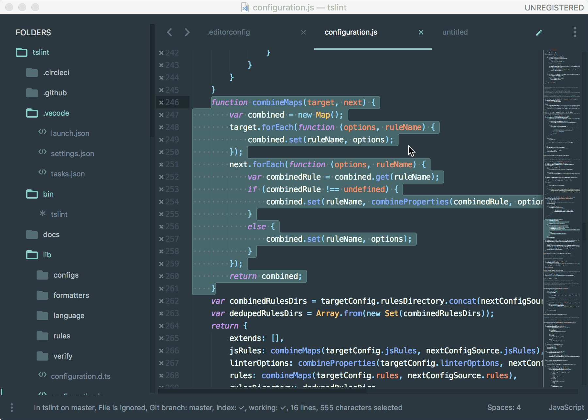
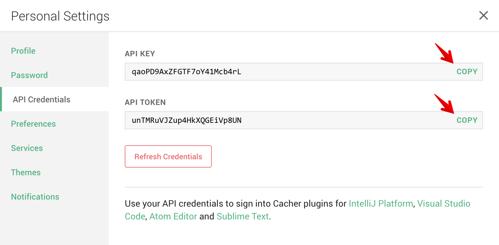

# Cacher

## About Cacher

[Cacher](https://www.cacher.io/) is the code snippet organizer for pro developers. It is a cross-platform, cloud-based app used to curate a snippet library for you and your team.

Features:
- Support for editing and viewing 100+ programming languages.
- Flexible color-coded labels to categorize snippets.
- Shareable snippet pages via Cacher's code-sharing community: [snippets.cacher.io](https://snippets.cacher.io/)
- Team and organization features like shared libraries, notifications, role management and code reviews.
- Desktop clients for Windows, macOS and Linux.
- Full-featured web app: [app.cacher.io](https://app.cacher.io/)

## About Cacher package

This package for Sublime Text gives Cacher users the ability to perform popular actions on their personal and team snippet libraries.

## Getting Started

1. Open the Sublime Text Command Palette (Ctrl/Cmd+Shift+P) and enter the command **Package Control: Install Package**.
2. Search for **Cacher** and install the package.
3. From the Command Palette, execute **Cacher: Setup**.

    

4. You'll be presented with an option to view credentials. Click **Open Cacher**. You can also navigate to the page via: [app.cacher.io/enter?action=view_api_creds](https://app.cacher.io/enter?action=view_api_creds)

     

5. From the popped up webpage, sign up or sign in as a Cacher user.
6. Once you are signed into Cacher, you should see a dialog on the top-right corner with your **API KEY** and **API TOKEN** values.

    

7. Back in Sublime, enter your API key from step 5 into the input prompt.

    

8. Next, enter your API token.
9. You're all set! Open the Command Palette and type in **Cacher: Insert Snippet** to try inserting a snippet into your active editor.

> Pro tip: Your credentials are saved in `.cacher/credentials.json` under your OS's home folder. This file is also used to authenticate other apps, like [Cacher CLI](https://github.com/cacherapp/cacher-cli),
[Cacher for VSCode](https://marketplace.visualstudio.com/items?itemName=Cacher.cacher-vscode) and [Cacher for Atom](https://atom.io/packages/cacher)

## Commands

### Insert Snippet

> Shortcut: Alt+Shift+I

Search for and insert a snippet file from your personal and team libraries.

The **Insert Snippet** command can be be launched from:
- [Command Palette](#command-palette)
- [Keyboard Shortcut](#keyboard-shortcut)
- [Context Menu](#context-menu)
- [Tools -> Cacher](#tools---cacher)

### Create Snippet

> Shortcut: Alt+Shift+C

Create a snippet from either the text selection or the entire file (no selection). The command starts a wizard for you to choose:

 - Personal or team library (if using teams)
 - Title
 - Description - *Optional*
 - Filename
 - Public/private permission 
 - Label - *Optional*

> Pro tip: You can create a single snippet from multiple files selected in the sidebar.. 

The **Create Snippet** command can be launched from:
- [Command Palette](#command-palette)
- [Keyboard Shortcut](#keyboard-shortcut)
- [Context Menu](#context-menu)
- [Tab Context Menu](#tab-context-menu)
- [Sidebar Menu](sidebar-menu)
- [Tools -> Cacher](#tools---cacher)

### Open Snippet in App

> Shortcut: Alt+Shift+O

Find a snippet from your libraries and open it in the Cacher web app.

The **Open Snippet in App** command can be be launched from:
- [Command Palette](#command-palette)
- [Keyboard Shortcut](#keyboard-shortcut)
- [Tools -> Cacher](#tools---cacher)

### Open Snippet Page

> Shortcut: Alt+Shift+P

Find a snippet from your libraries and open its Snippets page ([example](https://snippets.cacher.io/snippet/b49ccec98297a95d97e8)).

The **Open Snippet Page** command can be be launched from:
- [Command Palette](#command-palette)
- [Keyboard Shortcut](#keyboard-shortcut)
- [Tools -> Cacher](#tools---cacher)

### Refresh Snippets

> Shortcut: Alt+Shift+R

Reload your Cacher snippets. Do this once you've made a change to your snippets outside of Sublime.

The **Refresh Snippets** command can be be launched from:
- [Command Palette](#command-palette)
- [Keyboard Shortcut](#keyboard-shortcut)
- [Tools -> Cacher](#tools---cacher)

### Setup

Kick off the setup wizard to authenticate your Cacher account. Run this command if you need to switch users.

The **Setup** command can be be launched from:
- [Command Palette](#command-palette)
- [Keyboard Shortcut](#keyboard-shortcut)
- [Tools -> Cacher](#tools---cacher)

## Launch Commands

### Command Palette

This is the standard way to access Sublime commands. Use keyboard shortcut: **Ctrl/Cmd+Shift+P**.

### Keyboard Shortcut

The fastest way to access Cacher commands.

- **Alt+Shift+I** - Insert Snippet
- **Alt+Shift+C** - Create Snippet
- **Alt+Shift+O** - Open Snippet in App
- **Alt+Shift+P** - Open Snippet Page
- **Alt+Shift+R** - Refresh Snippets

### Context Menu

While in an active editor, you can right-click the background to either **Insert Snippet** or **Create Snippet**.

*With a text selection*
- **Insert Snippet** will replace the selected text with the snippet file content.
- **Create Snippet** will create a snippet with the selected text as its file content.

*Without a text selection*
- **Insert Snippet** will insert the snippet file content at the caret.
- **Create Snippet** will create a snippet from the entire file's content.

### Tab Context Menu

You can right-click on any tab in the window to trigger the **Create Snippet** command.

### Sidebar Menu

Select one or more files in the sidebar to send to the **Create Snippet** command. The new snippet will contain contents of the selected files.

### Tools -> Cacher

Cacher adds a submenu to the **Tools** menu. You can find all the available commands here.

## Requirements

The Cacher Sublime plugin is available for registered users on a Pro/Team plan. For a 14-day free Team trial, sign up at [app.cacher.io](https://app.cacher.io).

## Getting Help

Find help articles and file support tickets: [support.cacher.io](https://support.cacher.io)

## Release Notes

### 1.0.0

Initial release of Cacher plugin. 

Adds commands:

- Insert Snippet
- Create Snippet
- Open Snippet in App
- Open Snippet Page
- Refresh Snippets
- Setup
